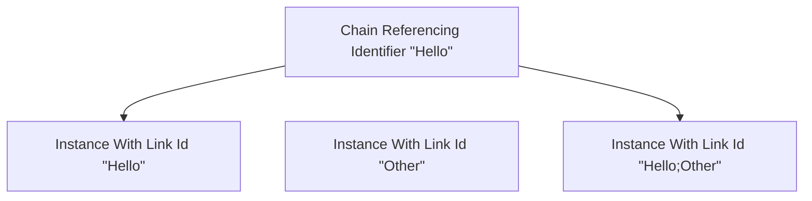

# Links

Links are what tie your maps's presence in the [Roblox DOM](https://create.roblox.com/docs/reference/engine/classes/DataModel) to the world of ChainLink. Whether a given Link is used for [referencing](#referencing) or [triggering](#triggering), all Links are represented as a [tag](https://create.roblox.com/docs/reference/engine/classes/CollectionService) called `Link` on a given instance.

## Referencing

Links can have Ids assigned by the map developer which [Chain](chain) uses to reference instances. Specifically, Chain will reference an identifier, which is a part of a Link Id.

The syntax to define a Link Id is very simple. It is a list of individual identifiers separated by semicolons. Instances tagged as a Link can have multiple identifiers in their Link Id so that they can be more robustly referenced depending on your needs. Examples of this would be `Hello`, `Other`, and `Hello;Other`. These constitute single Link Ids, with the last one having multiple identifiers as opposed to the first two only having one identifier. Chain would be able to reference these examples as such:

 

After having tagged an instance with `Link`, you can define the instance's Link Id by adding an attribute of type `string` named "LinkId" to the instance. Instances tagged as a Link do not need to have a Link Id. They only need a Link Id if they are intended to be referenced by Chain.

## Triggering

Links are also an entry point of Chain for map developers to take advantage of ChainLink's [implementation](../implementation/practices) by the game developer.

When a Link is triggered, ChainLink will check if an attribute of type `string` named "LinkChain" is present on the linked instance. If this attribute exists, it will treat the value of the attribute as a Chain script and execute it. This is useful if the game developer has ChainLink triggering links very often, so that various game events will be able to trigger the systems created in ChainLink by the map developer.

## Doing Both

Links can be used for both referencing and triggering. Instances tagged as Link can have both the "LinkId" and "LinkChain" attributes, or only one, but not neither. If neither, just remove the Link tag from the instance as it serves no other purpose.
